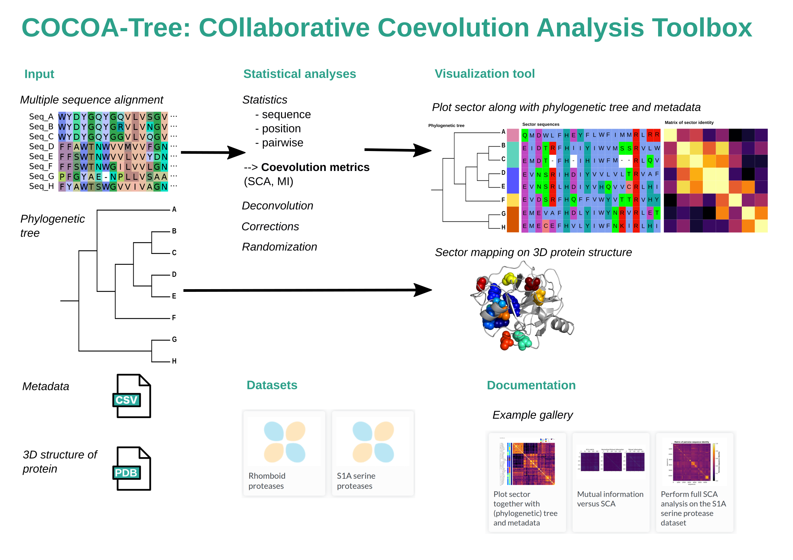

.. cocoatree documentation master file, created by
   sphinx-quickstart on Thu Apr 29 13:51:21 2021.
   You can adapt this file completely to your liking, but it should at least
   contain the root `toctree` directive.

.. toctree::
  :hidden:
  :glob:
  :caption: Contents

  interface_cocoatree_pymol.rst

######################################################
COCOA-Tree: COllaborative COevolution Analysis Toolbox
######################################################

COCOA-Tree is a `Python <https://www.python.org>`_ library to perform coevolution
analysis of protein sequence data. It includes different coevolution metrics and
corrections, and allows for an easy comparison of the methods.

The specificity of COCOA-Tree is the inclusion of a visualization tool that allows
the user to confront coevolution analyses with a phylogenetic tree and metadata
to facilitate the understanding of protein sectors.

COCOA-Tree also provides integration with the molecular visualization software
`PyMOL <https://pymol.org>`_ allowing to map protein sector predictions on 3D
structures.

The software is organized in different modules detailed below:

Example gallery
---------------

Various examples of COCOA-Tree's use can be found in the Gallery.

If you wish to perform a simple SCA analysis, go to
:py:obj:`Simple SCA example <../examples/plot_simple_sca.py>`

For a detailed SCA analysis, go to
:py:obj:`Full SCA analysis <../examples/plot_full_SCA_analysis.py>`

Citing COCOA-Tree
-----------------

If you use COCOA-Tree in a scientific publication, we would appreciate citations
to the following paper:

   BEST PAPER EVER

License information
-------------------

Conditions on the use and redistribution of this package.

.. literalinclude:: ../LICENSE
