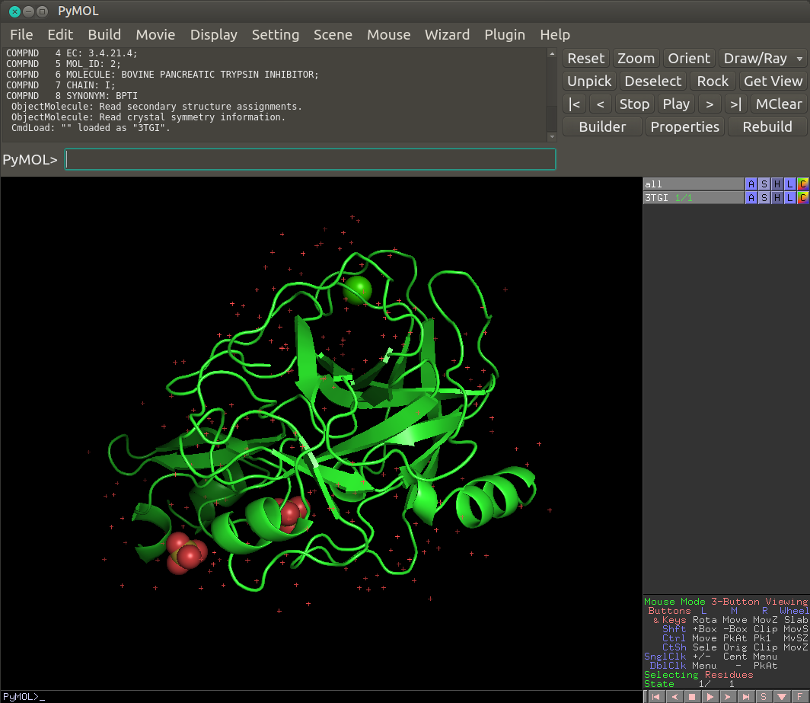
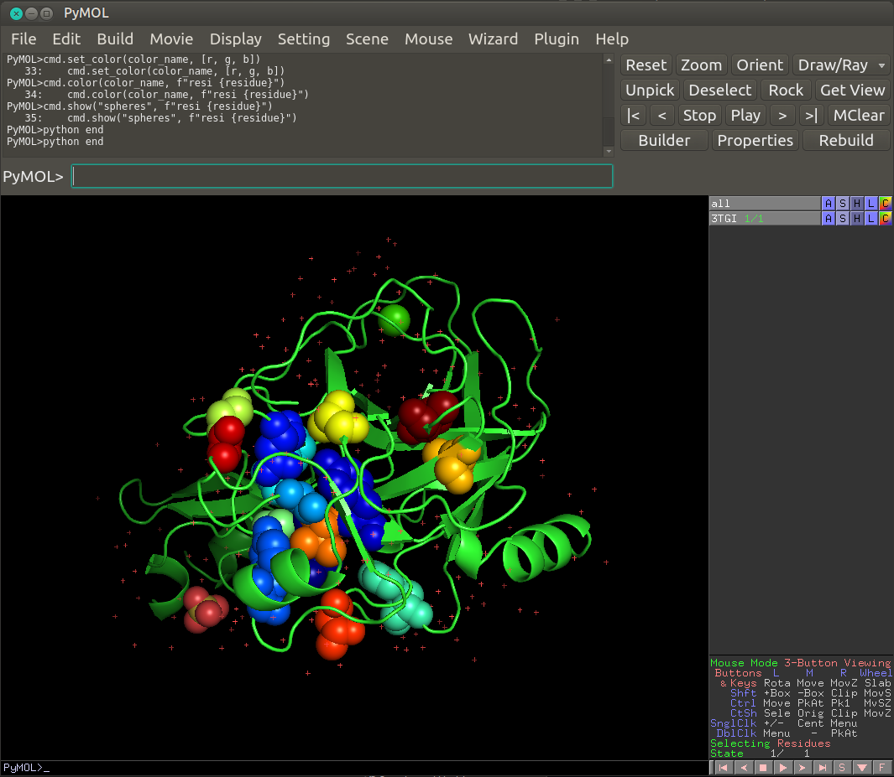

==============================================
Color sector residues on 3D structure in Pymol
==============================================

This example shows how to color a set of residues on a 3D protein structure
based on their contribution to the independent component of the sector that is
considered using the Pymol software.

Pymol should be installed on your computer.

Open the PDB in Pymol
---------------------

After performing your coevolution analysis such as in the example
plot_full_SCA_analysis.py, you should have a .npy object with the positions of
the residues corresponding to a given sector mapped on the sequence of your
reference PDB file.

In the case of the S1A serine proteases, we use the rat's trypsin PDB
`3TGI.pdb`.

Open a Pymol window, then click on 'file' -> 'open' and select the PDB file
that is locally present on your computer.

Adapt Pymol code to your local path
-----------------------------------

Save the pymol code that is displayed below and modify it so that it works on
your local environment :

    - change the path **line 20** to your local path towards your numpy object
    - **line 24**, you can change the `cmap` parameter to any matplotlib's
      colormap

Execute Pymol code
------------------

In Pymol's terminal prompt, copy the following line with the appropriate path
to your pymol code :
`@path_to_pymol_code`

The sector residues should appear as colored spheres on the 3D protein
structure such as in the following image.

Pymol code to save locally
--------------------------

.. code-block:: python
    :linenos:
        
    python
    import numpy as np
    import matplotlib.colors as colors
    import matplotlib.pyplot as plt

    def _generate_colors_from_colormaps(n_colors, cmap="jet", as_hex=True):
        """
        Generate a list of n colors from colormap
        """

        colormap = plt.get_cmap(str(cmap))
        indx = np.linspace(0, 1, n_colors)
        indexed_colors = [colormap(i) for i in indx]
        if as_hex:
            indexed_colors = [colors.to_hex(i) for i in indexed_colors]
        return indexed_colors

    residue_swap = list(np.load('your/path/to/color_sector_1_pymol.npy'))
    residue_pos = residue_swap[0].astype('int')

    nvals = len(residue_pos)
    colormap = _generate_colors_from_colormaps(nvals, cmap='jet', as_hex=False)

    for i in range(len(residue_pos)):
        residue = residue_pos[i]
        r = colormap[i][0]
        g = colormap[i][1]
        b = colormap[i][2]

        color_name = f"residue_{residue}"
        cmd.set_color(color_name, [r, g, b])
        cmd.color(color_name, f"resi {residue}")
        cmd.show("spheres", f"resi {residue}")
    python end
